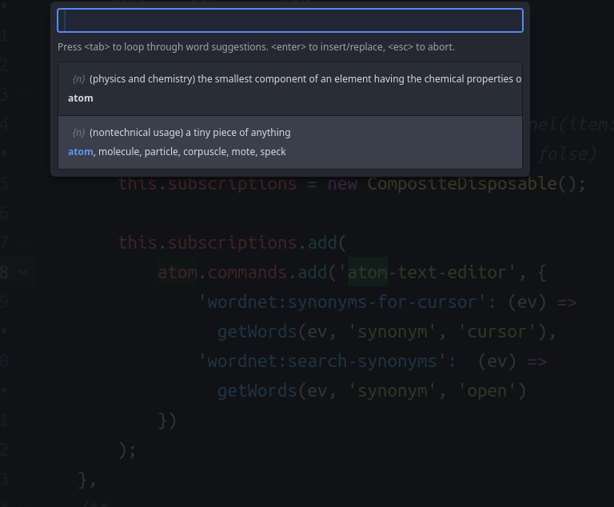

# atom-wordnet package

A Wordnet wrapper to display definitions and insert/replace synonyms.

**Warning:** It downloads and extracts the whole WordNet (~30mb) database.



At the moment this package is _not_ auto-activated (so needs to be toggled every time) and has _no keybindings_ (so you can find those that work best for you).

To **auto-activate** put the following line in your _init.coffee_:

```
atom.commands.dispatch(atom.workspace.element, 'wordnet:toggle')
```

Otherwise, call `wordnet:toggle` manually when you need it.

## Keybindings

This package does not automatically set any keybindings to avoid clashes.
If you would like keybindings, copy these lines to your _keymap.cson_ (and change the keys if you like):

```
'atom-text-editor':
    'alt-s': 'wordnet:synonyms-for-cursor'
'atom-workspace'
    'alt-a': 'wordnet:search-synonyms'
```

## Potential Future Improvements

* search for a word based on the selection
* fuzzy search + suggestions for words under cursor
* a helper-pane showing a definition for the word currently under the cursor
* automatic expansion of the currently typed word in the wordnet-search
* use user-defined fields from the wordnet database
* display categorisation, similar-to or antonyms
* part-of-speech guessing to only show relevant words
* integrate with other packages using the `natural` package and therefore having a wordnet-copy already
